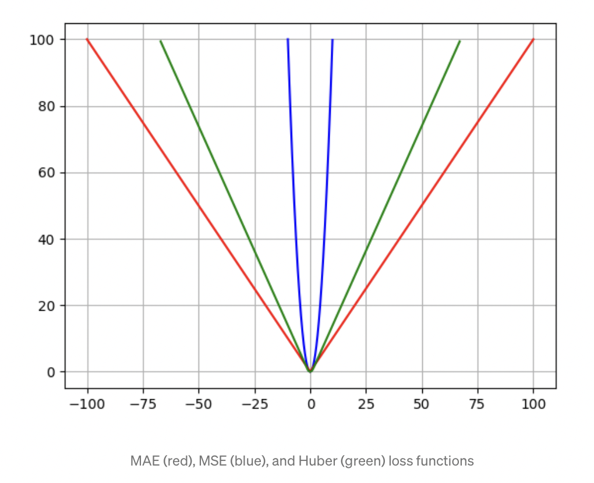

# Exploring Regression Metrics (Loss functions)
## MAE (Mean Absolute Error)

$$MAE(y^{true}, y^{pred}) = \frac{1}{n} \sum_{i=1}^{n}|y^{true}_{i} - y^{pred}_{i}|$$

It is the mean of the absolute value differences between the ground truth $y^{true}$ and the models predicted values $y^{pred}$.

## MSE (Mean Squared Error)

$$MSE(y^{true}, y^{pred}) = \frac{1}{n} \sum_{i=1}^{n}(y^{true}_{i} - y^{pred}_{i})^2$$

It is the mean of the squared differences between the groud truth and the models predictions. It is more sensitive to outliers since the error (=differences) is squared compared to the MAE where we simply take the absolute value. 

## Huber Loss

$$Huber(y^{true}, y^{pred}) = \begin{cases}\frac{1}{2} \sum_{i=1}^{n}(y^{true}_{i} - y^{pred}_{i})^{2} & \text { for }|a| \leq \delta \\ \delta \cdot\left(|a|-\frac{1}{2} \delta\right), & \text { otherwise }\end{cases}$$

